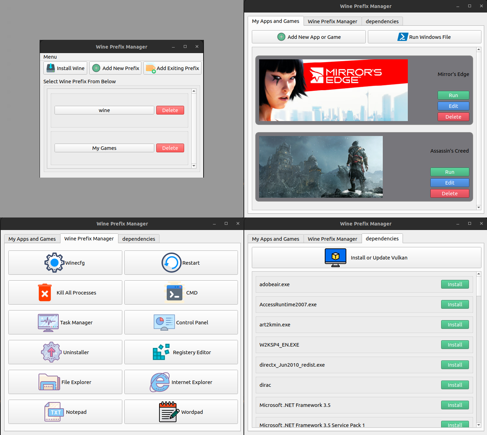

# User Interface for Managing Wine


Easily manage your wine with this application And enjoy playing on Linux.

You can have several wine prefixes at the same time. Easily install and run your games and softwares. Easily download and install vulkan and prerequisites.

## Installation
 - Simple Way

Open Terminal in project directory and enter

 ```bash
python3 installer.py
```

 - Second Way
 
First install these packages
```bash
sudo apt install python3-pip python3-venv
```
Then navigate to project folder and 
```bash
python3 -m venv ./venv
source ./venv/bin/activate
pip install -r req.txt
```
Finally run it
```bash
python3 main.py
```

### Information
This software is written with PyQt5. Do not manipulate txt files.